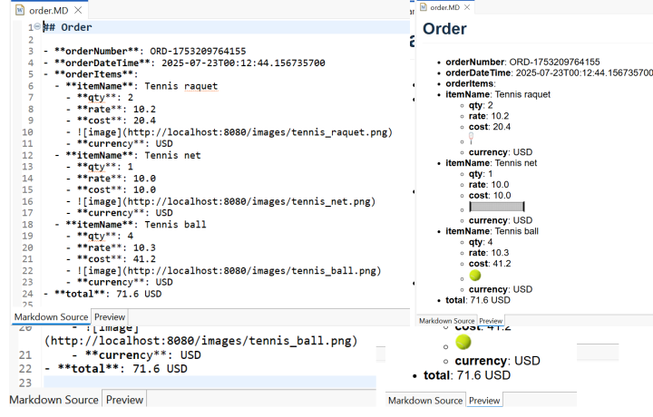
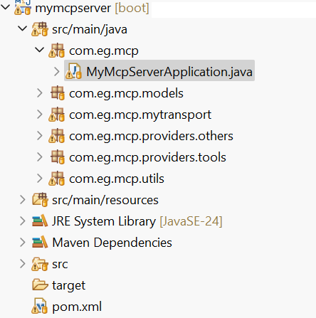
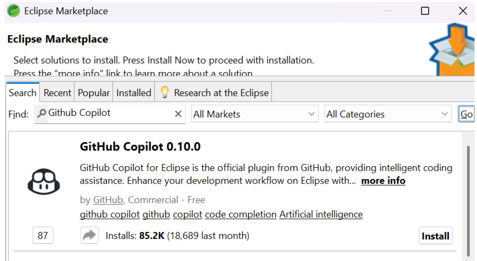
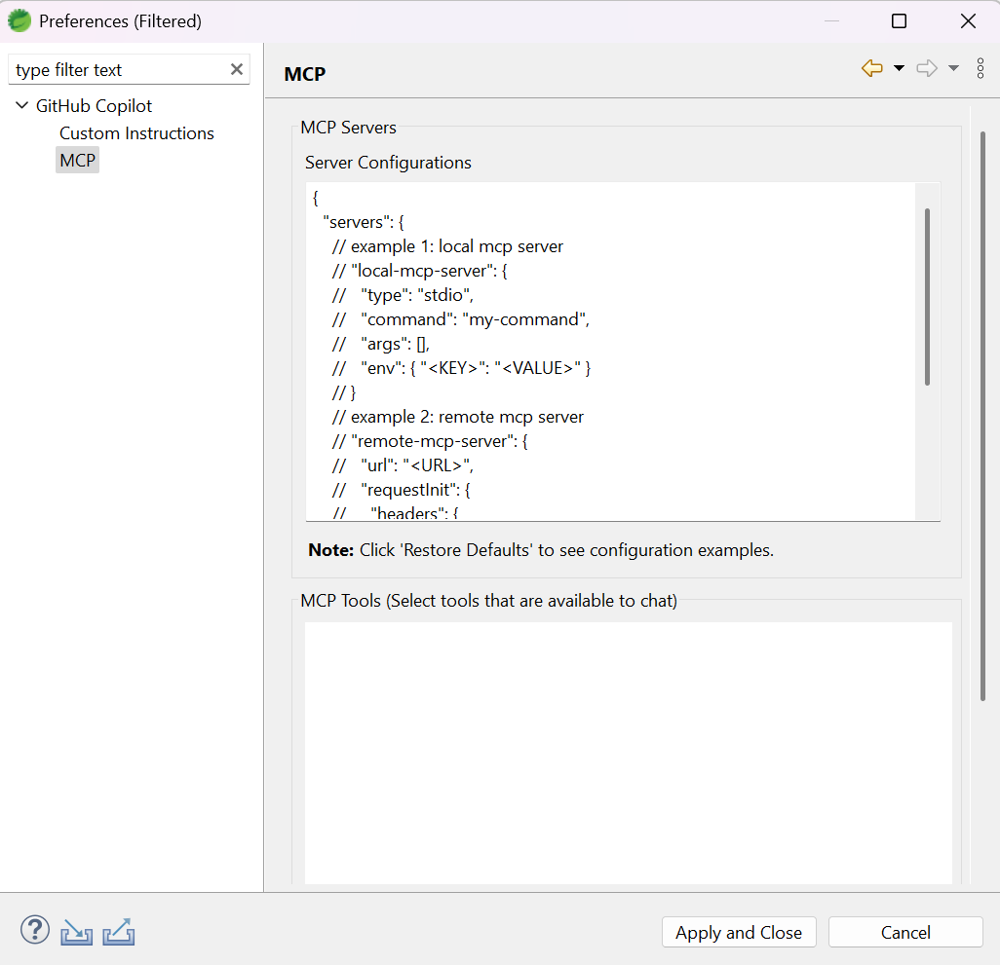
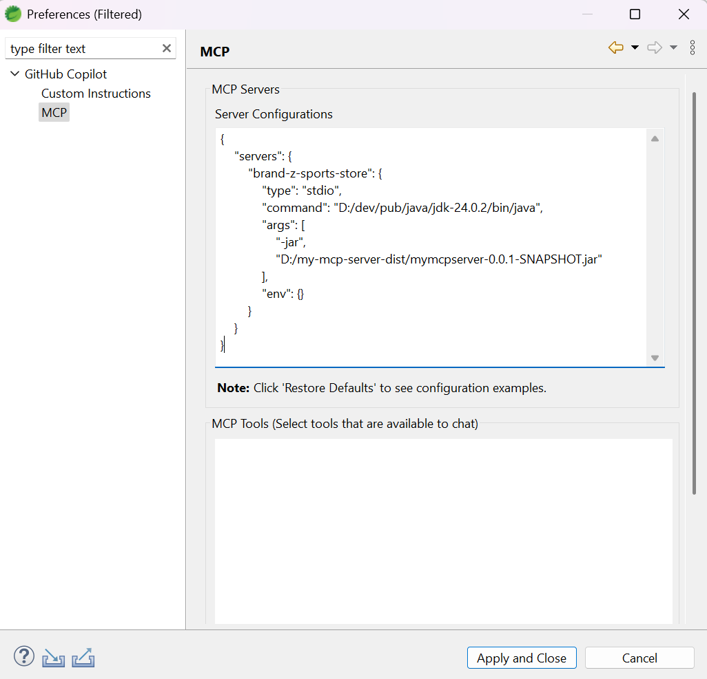
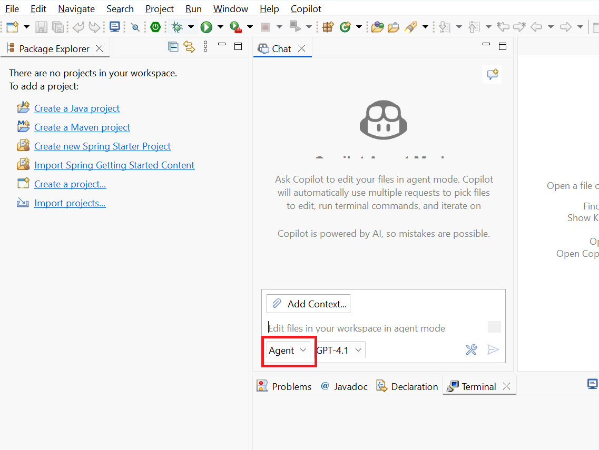
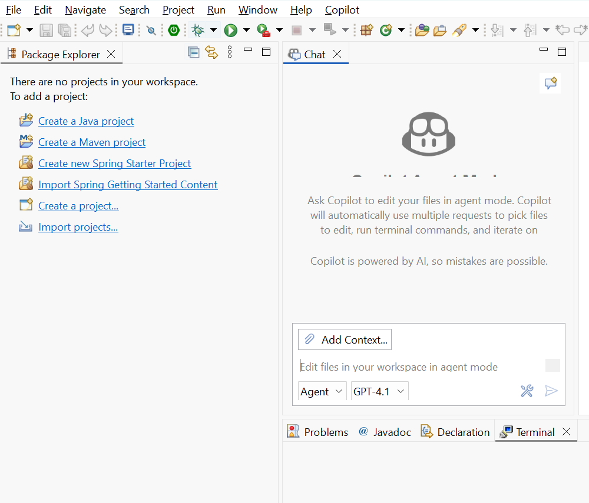
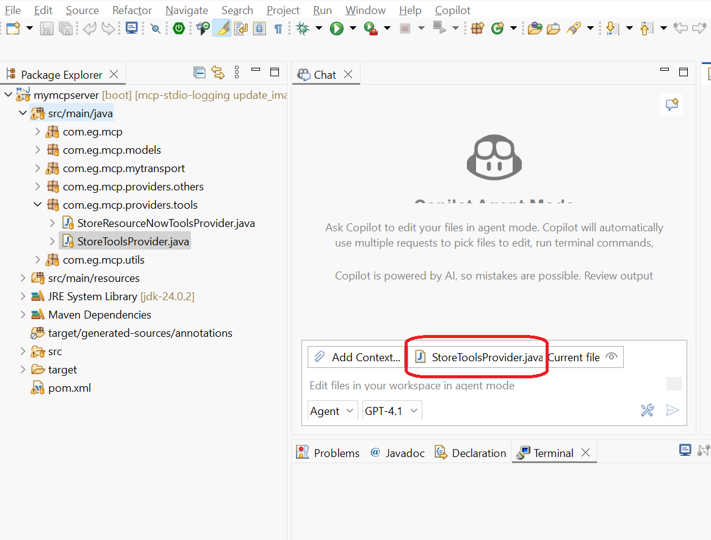

# Logging MCP Protocol When Using stdio

If you haven’t heard of MCP — the Model Context Protocol — you’ve probably been living under a rock. The Model Context Protocol (MCP) is becoming widely recognized, standardizing how applications provide context to LLMs. It barely needs an introduction anymore. Still, for the sake of completeness, let me borrow selectively from the [official MCP site](https://modelcontextprotocol.io/introduction). Do take a moment to explore the well-explained pages if you're new to MCP.

MCP is an open protocol that standardizes how applications provide context to LLMs. It’s designed to help developers build agents and complex workflows on top of LLMs. Since LLMs often need to interact with external data and tools, MCP offers:

- A growing set of prebuilt integrations that LLMs can plug into directly  
- The flexibility to switch between different LLM providers and vendors  
- Best practices for securing data within your own infrastructure

---

### Why This Article?
When working with stdio-based MCP clients and servers — like GitHub Copilot and MCP servers — it becomes surprisingly difficult to observe or debug protocol messages. The typical go-to, MCP Inspector, often doesn’t help when the client launches the MCP server directly over stdio, with no proxy, and no HTTP or SSE transport to hook into.   

This article shows how to break through that limitation.    

We’ll explore simple, effective techniques for logging MCP protocol communication over stdio, making otherwise hidden interactions observable and explainable — especially during local testing and debugging. The goal is to enable deeper visibility into real-time LLM completion flows.    

Before diving into logging, though, we’ll get a basic MCP setup running with a custom server and client.    

üí° Everything discussed in this article can be done at no cost, using free tools and open-source components.   


---

### Choosing an MCP Client

Lately, I’ve been exploring **GitHub Copilot**, so we’ll start with that — specifically, the **GitHub Copilot for Eclipse** plugin (officially from GitHub). It gives us a ready-made MCP client, so we can focus on building and observing the MCP server side.

That said, the same approach works with any MCP-compatible client, such as:

- GitHub Copilot for VSCode  
- Claude Desktop  
- Any other tool that speaks the MCP protocol and allows configuring an external server

---

### What Comes Next

Once we have the basic setup running, we’ll take it further and:

- Write a minimal custom MCP client  
- Connect it to the same MCP server  
- Use the same logging trick to inspect `stdio`-based messages in both directions
- We will demonstrate using this MCP client what we were unable to demonstrate using Copilot. Namely using resources, Prompts and Completions.  This is because standard Copilot integrations often focus primarily on tool invocation, making direct observation of other protocol features challenging. We will also discuss why this is so.  
- We will not be demonstrating LLMs invoking tools in this custom MCP client. That has been already discussed with Copilot. Also getting a free LLM which is that smart is not so easy.

We’ll also explore how the **MCP Inspector** can be used alongside our custom server. When the transport is `stdio`, the Inspector essentially behaves like another MCP client — one that doesn’t include an LLM. Think of it as an “MCP browser” or a Postman-like tool for MCP: it let's you inspect messages, invoke tools, and debug interactions directly. (Let's ignore agentic Postman, which is a different topic.)

---

### Why Start with stdio?

You might ask — why start with `stdio` at all? Why not just use HTTP or SSE?

Well, that’s where MCP begins. `stdio` is the default and often the most direct way for LLM clients to communicate with custom agents — especially in plugin-style environments like Copilot. Even **Claude Desktop** only [recently added support for Remote MCP](https://support.anthropic.com/en/articles/11175166-getting-started-with-custom-integrations-using-remote-mcp), and that too after [a long-standing community request](https://github.com/orgs/modelcontextprotocol/discussions/16). It's anticipated that SSE will eventually become a more widely embraced transport option.  

So for now, we’re sticking with `stdio` — and figuring out how to peek under the hood to see what's really going on which should be useful for beginners.


---

### In a Hurry? Here Are the Three Tricks Right Upfront
If you're already familiar with MCP or have a working setup and just need the logging shortcut, here's the core idea, demonstrated in Java. This approach is adaptable to virtually any language.

Method 1: Direct SDK/Library Logging (The Cleanest Route)

Depending on the MCP SDK or library you're using, you might be able to tap into the protocol output directly by configuring its built-in logger. This is generally the cleanest and most performant route—when it works.

Method 2: Extending the SDK logging.  

If the SDK/library does not provide adequate logging for the MCP protocol, you can identify and utilize its extension points to implement custom logging. This document demonstrates this approach also specifically for enabling outgoing MCP JSON logging, which was initially missing from the default setup.

Method 3: Standard I/O (stdio) Interception with "Tee" (The Robust Alternative)

However, if you encounter limitations—for instance, the library isn't logging the full MCP JSON (as we'll see later with outgoing MCP protocol JSON)—then a more direct approach to intercepting System.in and System.out is necessary. This method relies on how the SDK handles internal stream wiring and is not always the "best" approach in terms of pure performance, but it offers maximum visibility with minimal intrusion.

That’s why, when nothing else works—or when you want a reliable way to capture every byte flowing through standard I/O:

🔁 Tee is your friend.

The Apache Commons IO TeeOutputStream and TeeInputStream classes allow you to duplicate a stream's data. As data is written to or read from the original stream, a copy is simultaneously sent to a second, "branched" stream. This is inspired by the Unix tee command, which splits a stream into two, sending one to standard output and another to a file.

You don't have to write to a file as shown below for simplicity. Your "tee" target can be a logger, a socket, a GUI component, an in-memory buffer, or even a queue—anything that helps you observe or capture the data flow without breaking it. For performance, especially in production, consider streaming to a more efficient target than direct file writes.

```java

    FileOutputStream fos = new FileOutputStream(new File(dir, "out.txt"));  // For outgoing messages
    FileOutputStream fis = new FileOutputStream(new File(dir, "in.txt"));   // For incoming messages
    FileOutputStream fcs = new FileOutputStream(new File(dir, "combined.txt")); // For combined messages

    PrintStream originalOutputStream = System.out;  
    InputStream originalInputStream = System.in;  
    
    System.setOut(new PrintStream(
        new TeeOutputStream(originalOutputStream, new TeeOutputStream(fos, fcs))
    ));  
    System.setIn(new TeeInputStream(
        originalInputStream, new TeeOutputStream(fis, fcs)
    )); 
     
```

We're using Spring AI as an MCP SDK purely for demonstration purposes here. The same logging concepts and inspection strategies should work just as well with other MCP SDKs, regardless of language or framework. These are protocol-level techniques, not specific to Spring or Java.

Now, for everyone else who’s not quite in a hurry—let’s walk through the setup step by step.  

### Co Pilot Conversation Illustration    


 

WIP : Capturing the whole conversation   

Note: would have been glad to render the MCP logs also same way. But they are too verbose when formatted. Rendering without formatting wont add visual immediate value.

### Prerequisites

These are not strong prerequisites.  
You can use any other language, IDE and carry out the same experiments.  

That said I am using
- Spring Tools for Eclipse
- Java 22
- Maven 


### MCP Server setup

Here is what the MCP server project looks like in eclipse
 

I may not capture the complete code here. But will cover what I presume are the necessary upfront bits here.  
The whole code will be shared towards the end.  


#### pom.xml
```xml
<?xml version="1.0" encoding="UTF-8"?>
<project xmlns="http://maven.apache.org/POM/4.0.0"
	xmlns:xsi="http://www.w3.org/2001/XMLSchema-instance"
	xsi:schemaLocation="http://maven.apache.org/POM/4.0.0 https://maven.apache.org/xsd/maven-4.0.0.xsd">
	<modelVersion>4.0.0</modelVersion>
	<parent>
		<groupId>org.springframework.boot</groupId>
		<artifactId>spring-boot-starter-parent</artifactId>
		<version>3.4.4</version>
		<relativePath /> <!-- lookup parent from repository -->
	</parent>
	<groupId>com.example</groupId>
	<artifactId>mymcpserver</artifactId>
	<version>0.0.1-SNAPSHOT</version>
	<name>mymcpserver</name>
	<description>mymcpserver</description>

	<properties>
		<java.version>22</java.version>
		<spring-ai.version>1.0.0</spring-ai.version>
	</properties>

	<dependencies>
	
<dependency>
<groupId>org.springframework.ai</groupId>
<artifactId>spring-ai-starter-mcp-server</artifactId>

</dependency>

	<dependency>
  <groupId>org.springframework.boot</groupId>
  <artifactId>spring-boot-starter-web</artifactId>
</dependency>

<dependency>
    <groupId>commons-io</groupId>
    <artifactId>commons-io</artifactId>
    <version>2.19.0</version>
</dependency>
<dependency>
            <groupId>com.logaritex.mcp</groupId>
            <artifactId>spring-ai-mcp-annotations</artifactId>
            <version>0.1.0</version>
        </dependency>
        <dependency>
    <groupId>com.fasterxml.jackson.dataformat</groupId>
    <artifactId>jackson-dataformat-xml</artifactId>
</dependency>
	</dependencies>

	<dependencyManagement>
		<dependencies>
			<dependency>
				<groupId>org.springframework.ai</groupId>
				<artifactId>spring-ai-bom</artifactId>
				<version>${spring-ai.version}</version>
				<type>pom</type>
				<scope>import</scope>
			</dependency>
		</dependencies>
	</dependencyManagement>

	<build>
		<plugins>
			<plugin>
				<groupId>org.springframework.boot</groupId>
				<artifactId>spring-boot-maven-plugin</artifactId>
			</plugin>
		</plugins>
	</build>
	

</project>
```
#### application.properties
```properties
spring.application.name=mymcpserver
spring.main.web-application-type=none
spring.ai.mcp.server.name=brand-z-sports-store
spring.ai.mcp.server.version=0.0.1

#STDIO will work if banner is disabled
spring.main.banner-mode=off
#Empty to suppress default Spring Boot console logging, important for stdio transport.
logging.pattern.console= 
#just ensure below path is there and accessible
logging.file.name=d:/temp/logs/spring.log
logging.level.root=ERROR
logging.level.io.modelcontextprotocol.server.transport=DEBUG
logging.level.com.eg.mcp.mytransport=DEBUG
logging.level.com.eg.mcp=DEBUG
#logging.level.io.modelcontextprotocol.spec=DEBUG


mine.mcpurl=false

```
Do remember to use existing and reachable locations for the logging file.   

#### MyMcpServerApplication.java
```java
package com.eg.mcp;

import java.io.File;
import java.io.FileNotFoundException;
import java.io.FileOutputStream;
import java.io.InputStream;
import java.io.PrintStream;
import java.util.ArrayList;
import java.util.List;

import org.apache.commons.io.IOUtils;
import org.apache.commons.io.input.TeeInputStream;
import org.apache.commons.io.output.TeeOutputStream;
import org.slf4j.Logger;
import org.slf4j.LoggerFactory;
import org.springframework.ai.tool.ToolCallbackProvider;
import org.springframework.ai.tool.method.MethodToolCallbackProvider;
import org.springframework.boot.SpringApplication;
import org.springframework.boot.autoconfigure.SpringBootApplication;
import org.springframework.context.annotation.Bean;
import org.springframework.http.MediaType;

import com.eg.mcp.models.State;
import com.eg.mcp.mytransport.MyStdioServerTransportProvider;
import com.eg.mcp.providers.others.StoreMcpCompleteProvider;
import com.eg.mcp.providers.others.StoreMcpPromptProvider;
import com.eg.mcp.providers.others.StoreMcpResourceProvider;
import com.eg.mcp.providers.tools.StoreResourceNowToolsProvider;
import com.eg.mcp.providers.tools.StoreToolsProvider;
import com.eg.mcp.utils.CountryPromptDatabase;
import com.logaritex.mcp.spring.SpringAiMcpAnnotationProvider;

import io.modelcontextprotocol.server.McpServerFeatures;
import io.modelcontextprotocol.server.McpServerFeatures.SyncCompletionSpecification;
import io.modelcontextprotocol.server.McpServerFeatures.SyncPromptSpecification;
import io.modelcontextprotocol.server.McpServerFeatures.SyncResourceSpecification;
import io.modelcontextprotocol.spec.McpSchema;
import io.modelcontextprotocol.spec.McpServerTransportProvider;
import jakarta.annotation.PostConstruct;
import jakarta.annotation.PreDestroy;

@SpringBootApplication
public class MyMcpServerApplication {
	private static Logger logger=LoggerFactory.getLogger(StoreToolsProvider.class);
	
	private FileOutputStream fos;
	private FileOutputStream fis;
	private FileOutputStream fcs;
	
	
	@PostConstruct
	private void open() throws FileNotFoundException
	{
		//just ensure path is there and accessible
		//follow better practices to avoid hardcoding
		File dir= new File("d:/temp");
		
		PrintStream originalOutputStream=System.out;
		InputStream originalInputStream=System.in;
		
		fos= new FileOutputStream(new File(dir, "out.txt"));
		fis= new FileOutputStream(new File(dir, "in.txt"));
		fcs= new FileOutputStream(new File(dir, "combined.txt"));
		TeeOutputStream to= new TeeOutputStream(originalOutputStream, new TeeOutputStream(fos, fcs));
		PrintStream ps= new PrintStream(to);
		
		TeeInputStream ti= new TeeInputStream(originalInputStream, new TeeOutputStream(fis, fcs));
		System.setOut(ps);
		System.setIn(ti);
		
		
	}
	
	@Bean 
	public State state()
	{
		return new State();
	}
	
	@PreDestroy
	private void close()
	{
		IOUtils.closeQuietly(fos);
		IOUtils.closeQuietly(fis);
		IOUtils.closeQuietly(fcs);
	}
	
	public static void main(String[] args) {
		SpringApplication.run(MyMcpServerApplication.class, args);
	}
	
	
	
	@Bean
	public ToolCallbackProvider brandZTools(StoreToolsProvider storeToolsProvider, StoreResourceNowToolsProvider storeResourceNowToolsProvider) {
		return MethodToolCallbackProvider.builder().toolObjects(storeToolsProvider, storeResourceNowToolsProvider).build();
	}
	
	
	

	@Bean
	public List<SyncResourceSpecification> brandZPlaceHolderResources(StoreMcpResourceProvider storeMcpResourceProvider
			) {
		List<SyncResourceSpecification> specifications = new ArrayList<>();
		createPlaceHolderFaqResource(specifications);
		 
		 List<SyncResourceSpecification> otherResourceSpecifications = SpringAiMcpAnnotationProvider.createSyncResourceSpecifications(List.of(storeMcpResourceProvider));
	  for (SyncResourceSpecification otherResourceSpecification : otherResourceSpecifications) {
		  logger.debug("Adding MCP resource "+otherResourceSpecification.resource().name());
		  specifications.add(otherResourceSpecification);
	}
	   
	    return specifications;
	}

	private void createPlaceHolderFaqResource(List<SyncResourceSpecification> specifications) {
		McpSchema.Resource mcpResource = new McpSchema.Resource(
    		    "mcp://brandz/store/faqs",                            // URI for MCP to reference
    		    "store_faqs",                          // Name (for UI)
    		    "content of store faqs in plain text",            // Description (for LLM)
    		    MediaType.TEXT_PLAIN_VALUE,                                  // MIME type
    		    null                                           // Optional annotations
    		);
        logger.debug("Adding faqs ");
        var resourceSpecification = new McpServerFeatures.SyncResourceSpecification(mcpResource, (exchange, request) -> {
	
	        	
	        	 return new McpSchema.ReadResourceResult(List.of(
	                        new McpSchema.TextResourceContents(
	                            request.uri(),
	                            MediaType.TEXT_PLAIN_VALUE,
	                            "placeholder faq"
	                        )
	                    ));
	      
	    });
        specifications.add(resourceSpecification);

	}
	
	@Bean
	public List<SyncPromptSpecification> promptSpecs(StoreMcpPromptProvider storeMcpPromptProvider) {
		return SpringAiMcpAnnotationProvider.createSyncPromptSpecifications(List.of(storeMcpPromptProvider));
	}
	
	@Bean
	public List<SyncCompletionSpecification> completionSpecs(StoreMcpCompleteProvider storeMcpCompleteProvider) {
		return SpringAiMcpAnnotationProvider.createSyncCompleteSpecifications(List.of(storeMcpCompleteProvider));
	}
	
	
	@Bean

	public McpServerTransportProvider stdioServerTransport() {
		return new MyStdioServerTransportProvider();
	}
	
	@Bean
	public CountryPromptDatabase countryPromptDatabase()
	{
		return new CountryPromptDatabase();
	}

}


```
Note: How we leverage Tee[Input/Output]Stream.  That's the main purpose here. Although we do cover some MCP concepts too.  

#### StoreToolsProvider.java
```java
package com.eg.mcp.providers.tools;

import java.util.Arrays;
import java.util.List;
import java.util.stream.Collectors;

import org.slf4j.Logger;
import org.slf4j.LoggerFactory;
import org.springframework.ai.tool.annotation.Tool;
import org.springframework.stereotype.Service;

import com.eg.mcp.models.SportsItem;
import com.eg.mcp.models.State;

@Service
public class StoreToolsProvider {
	
	
	
	private static Logger logger=LoggerFactory.getLogger(StoreToolsProvider.class);
	private State state;
	public StoreToolsProvider(State state) {
		super();
		this.state = state;
		
	}
	
	
	

	
	@Tool(name = "get_store_speciality", description = "Describe whats special or unique about Brand Z sports store")
	public String getStoreSpeciality()
	{
		return "Brand Z Sports store only sells sports equipments or sporting goods that it manufactures";
	}

	@Tool(name = "get_items", description = "Get a list of sports equipments or sporting goods that Brand Z Sports store sells.")
	public List<String> getSportsEquipments()
	{
		logger.info("check if log is working");
		List<String> labels = Arrays.stream(SportsItem.values())
                .map(SportsItem::label)
                .collect(Collectors.toList());
		return labels;
	}
	@Tool(name = "get_selling_price_currency", description = "Get the currency for the various items selling price. Brand Z Sports store's selling price for an item would also be the same as the cost price of the item from a vendor's point of view.")
	public String getSportsEquipmentSellingPriceCurrency()
	{
		return state.getCurrency();
	}
	
	@Tool(name = "get_selling_price_of_item", description = "Get selling price of items that Brand Z Sports store sells. Is also the item's cost from buyers point of view")
	public float getSellingPriceOfItem(String itemName)
	{
		SportsItem sportsItem = SportsItem.labelOf(itemName);
		Float price=null;
		if(sportsItem!=null)
		{
			price=sportsItem.price();
		}
		
		if(price==null)
		{
			throw new RuntimeException("Brand Z Sorts store does not stock "+itemName);
		}
		return price;
	}
	
	@Tool(name = "get_details_of_item", description = "Get details of items that Brand Z Sports store sells.")
	public String getDetailOfItem(String itemName)
	{
		
		SportsItem sportsItem = SportsItem.labelOf(itemName);
		String detail=null;
		if(sportsItem!=null)
		{
			detail=sportsItem.detail();
		}
		if(detail==null)
		{
			throw new RuntimeException("Brand Z Sports store does not stock "+itemName);
		}
		return detail;
	}
	
	
	
	@Tool(name = "add_to_cart_item", description = "Add to cart item by specifying item name and its quantity")
	public void addToCart(String itemName, int quantity)
	{
		state.addToCart(itemName, quantity);
		
	}
	
	@Tool(name = "change_quantity_of_cart_item", description = "Change the quantity of the specified cart item to specified quantity")
	public void changeQuantityOfCartItem(String itemName, int quantity)
	{
		state.changeQuantityOfCartItem(itemName, quantity);
		
	}
	
	@Tool(name = "remove_item_from_cart_completely", description = "Remove item  from cart item by specifying item name. Can think that its quantity was reduced to 0. Item will no longer occur in the cart.")
	public void removeFromCart(String itemName)
	{
		state.removeFromCart(itemName);
		
	}
	
	@Tool(name = "checkout_and_pay", description = "Check out items in the cart. Payment is automatic. After checkout order is available as last order.")
	public void checkout()
	{
		state.checkout();
		
	}
	

}


```
That is our main Tools Provider class. Do have a look also these lines in our main Application class.  

```java
 @Bean
	public ToolCallbackProvider brandZTools(StoreToolsProvider storeToolsProvider, StoreResourceNowToolsProvider storeResourceNowToolsProvider) {
		return MethodToolCallbackProvider.builder().toolObjects(storeToolsProvider, storeResourceNowToolsProvider).build();
	}
```

StoreResourceNowToolsProvider is also a Tools provider. Will come to it after a while.

#### MyStdioServerTransport

Note on Implementation: In earlier versions (e.g., spring-ai-bom/1.0.0-M6), it was possible to achieve this logging via delegation. However, due to changes in the current SDK implementation, directly modifying the StdioServerTransportProvider or copying its relevant parts was necessary to inject the custom logging.

The complete code for this class won't be reproduced here; only the key changes will be highlighted.

```java
/*
 * Copied from StdioServerTransportProvider
 * with some changes
 */

package com.eg.mcp.mytransport;


public class MyStdioServerTransportProvider implements McpServerTransportProvider {

	private static final Logger logger = LoggerFactory.getLogger(MyStdioServerTransportProvider.class);

	//Omitting most of the copied code here

	/**
	 * Implementation of McpServerTransport for the stdio session.
	 */
	private class StdioMcpSessionTransport implements McpServerTransport {

	//Omitting most of the copied code here

		/**
		 * Starts the outbound processing thread that writes JSON-RPC messages to stdout.
		 * Messages are serialized to JSON and written with a newline delimiter.
		 */
		private void startOutboundProcessing() {
			Function<Flux<JSONRPCMessage>, Flux<JSONRPCMessage>> outboundConsumer = messages -> messages // @formatter:off
				 .doOnSubscribe(subscription -> outboundReady.tryEmitValue(null))
				 .publishOn(outboundScheduler)
				 .handle((message, sink) -> {
					 if (message != null && !isClosing.get()) {
						 try {
							 String jsonMessage = objectMapper.writeValueAsString(message);
							 // Escape any embedded newlines in the JSON message as per spec
							 jsonMessage = jsonMessage.replace("\r\n", "\\n").replace("\n", "\\n").replace("\r", "\\n");
							 logger.debug("Sending JSON message: {}", jsonMessage);
							 synchronized (outputStream) {
								 outputStream.write(jsonMessage.getBytes(StandardCharsets.UTF_8));
								 outputStream.write("\n".getBytes(StandardCharsets.UTF_8));
								 outputStream.flush();
							 }
							 sink.next(message);
						 }
						 catch (IOException e) {
							 if (!isClosing.get()) {
								 logger.error("Error writing message", e);
								 sink.error(new RuntimeException(e));
							 }
							 else {
								 logger.debug("Stream closed during shutdown", e);
							 }
						 }
					 }
					 else if (isClosing.get()) {
						 sink.complete();
					 }
				 })
				 .doOnComplete(() -> {
					 isClosing.set(true);
					 outboundScheduler.dispose();
				 })
				 .doOnError(e -> {
					 if (!isClosing.get()) {
						 logger.error("Error in outbound processing", e);
						 isClosing.set(true);
						 outboundScheduler.dispose();
					 }
				 })
				 .map(msg -> (JSONRPCMessage) msg);
	
				 outboundConsumer.apply(outboundSink.asFlux()).subscribe();
		 } // @formatter:on

		

	}

}

```
Note: We wrote this class to log the outgoing MCP protocol which was not being logged in StdioServerTransportProvider.StdioMcpSessionTransport. Unfortunately the way the original code was written I was forced to copy paste the code in a new class file and insert the log statement

```java
logger.debug("Sending JSON message: {}", jsonMessage);
```


Remember we supplied our own bean as shown below in MyMcpServerApplication.java, which we discussed earlier
```java
@Bean

	public McpServerTransportProvider stdioServerTransport() {
		return new MyStdioServerTransportProvider();
	}
```

This works because in org.springframework.ai.mcp.server.autoconfigure.McpServerAutoConfiguration we have this. 

```java
@Bean
	@ConditionalOnMissingBean
	public McpServerTransportProvider stdioServerTransport() {
		return new StdioServerTransportProvider();
	}
```

What it means is that if we dont provide our own McpServerTransportProvider however we write it then StdioServerTransportProvider will be used. Else our provided bean will be used. So we did not do anything illegal here. This bean was meant to replaced if needed. Only the way it was coded the original implementation did not offer us much opportunity to extend/delegate and insert the extra logging we needed.

Even if this is not attempted we do have the other Tee based approach.


Note: 
- The use of @Tool which is used for Tool functions. That said there is also a community project https://github.com/spring-ai-community/mcp-annotations which brings in various other annotations including @McpResource and others which also we will briefly have a look at.  
- Its important to give sensible descriptions and names in the Tool annotation. They must be meaningful to the LLM for it to make sense of the tools and use correctly.

### MCP Server build
Let's build the project using  

```bat
mvn clean package
```
at the top level of the multi module maven project.
That should deliver us a jar file mymcpserver/target/mymcpserver-0.0.1-SNAPSHOT.jar   
For convenience, let’s manually copy this JAR to a separate, more stable location — for example- d:/my-mcp-server-dist/mymcpserver-0.0.1-SNAPSHOT.jar   
Why do this?  
Because when the MCP server is running and a rebuild is triggered during development, the JAR file in target/ might be locked or in use, causing build failures. Moving it to a distribution folder ensures your MCP client can consistently launch it without interfering with your active codebase.


Note that the mymcpserver module includes a sister project, image-server, a simple Spring Boot app that serves images. This image-server project is optional. You can launch it by running the following command from within the image-server directory:

```bat
java -jar target/image-server-0.0.1-SNAPSHOT.jar
```

It simply serves images online at localhost:8080 for use by our MCP server and during the Copilot/MCP client demonstration. 


### Github Copilot eclipse plugin

This is the market place page https://marketplace.eclipse.org/content/github-copilot for Github Copilot eclipse plugin. I prefer installing it from within eclipse 


Here search for "Github Copilot" and press the "Go" Button.  
  
Press the install button and carry out the remaining steps.

#### Github Copilot eclipse plugin configuration

Visit Copilot> Edit Preferences  
  

Then reach here  
  
You can enable  GitHub CoPilot enterprise access using the Github Enterprise Authentication Endpoint textbox shown here. Thats just one of the many ways.
In my case my client enables the same by some other means that involves okta and github and SSO.
GitHub CoPilot can still be used without enterprise access within limits.

See https://docs.github.com/en/copilot/concepts/copilot-billing/about-individual-copilot-plans-and-benefits  

Further sub navigate to GitHub CoPilot> MCP  



Let's change the configuration to

```json
{
	"servers": {
		"brand-z-sports-store": {
			"type": "stdio",
			"command": "D:/dev/pub/java/jdk-22.0.2/bin/java",
			"args": [
				"-jar",
				"D:/my-mcp-server-dist/mymcpserver-0.0.1-SNAPSHOT.jar"
			],
			"env": {}
		}
	}
}
```
  

Press "Apply and close" button.

Revisit Copilot> Edit Preferences > GitHub CoPilot> MCP  


Visit Copilot > Open Chat  
  
**Ensure Agent Mode is Enabled**
This is the much-discussed Agent Mode, where GitHub Copilot can go beyond suggestions — it can actively write, modify and refactor your code among other capabilities. We won’t explore it here, but it’s worth enabling if you’re experimenting with MCP integrations.


### Checking the logs
- **Shutdown** your eclipse completely.  
- Optionally, if you like for clarity **delete the various existing** log files (e.g., in.txt, out.txt, combined.txt, spring.log).  
- Restart Eclipse, wait for Copilot to connect to the MCP server.  
- Observe how the log files update in real time as the connection is established.

You should now see MCP protocol communication captured clearly in JSON — both from the logger and your Tee-based file output.

Let's have a quick look at the various logs. I've deliberately not formatted them. It would occupy precious visual space then. Feel free to examine the MCP protocol in more detail. Just capturing whats available on startup of CoPilot.  

#### in.txt
```txt
{"method":"initialize","params":{"protocolVersion":"2025-03-26","capabilities":{"roots":{"listChanged":true}},"clientInfo":{"name":"brand-z-sports-store","version":"1.0.0"}},"jsonrpc":"2.0","id":0}
{"method":"notifications/initialized","jsonrpc":"2.0"}
{"method":"tools/list","jsonrpc":"2.0","id":1}

```

#### out.txt
```txt
{"jsonrpc":"2.0","id":0,"result":{"protocolVersion":"2024-11-05","capabilities":{"completions":{},"logging":{},"prompts":{"listChanged":true},"resources":{"subscribe":false,"listChanged":true},"tools":{"listChanged":true}},"serverInfo":{"name":"brand-z-sports-store","version":"0.0.1"}}}
{"jsonrpc":"2.0","id":1,"result":{"tools":[{"name":"get_tennis_net_image","description":"Returns the URL of the image of the tennis net","inputSchema":{"type":"object","properties":{},"required":[],"additionalProperties":false}},{"name":"get_football_image","description":"Returns the URL of the image of the football","inputSchema":{"type":"object","properties":{},"required":[],"additionalProperties":false}},{"name":"change_quantity_of_cart_item","description":"Change the quantity of the specified cart item to specified quantity","inputSchema":{"type":"object","properties":{"itemName":{"type":"string"},"quantity":{"type":"integer","format":"int32"}},"required":["itemName","quantity"],"additionalProperties":false}},{"name":"checkout_and_pay","description":"Check out items in the cart. Payment is automatic. After checkout order is available as last order.","inputSchema":{"type":"object","properties":{},"required":[],"additionalProperties":false}},{"name":"get_cart_content_in_markdown","description":"get cart content formatted in markdown","inputSchema":{"type":"object","properties":{},"required":[],"additionalProperties":false}},{"name":"get_last_order_content_in_xml","description":"get last order content formatted in xml","inputSchema":{"type":"object","properties":{},"required":[],"additionalProperties":false}},{"name":"get_selling_price_currency","description":"Get the currency for the various items selling price. Brand Z Sports store's selling price for an item would also be the same as the cost price of the item from a vendor's point of view.","inputSchema":{"type":"object","properties":{},"required":[],"additionalProperties":false}},{"name":"remove_item_from_cart_completely","description":"Remove item  from cart item by specifying item name. Can think that its quantity was reduced to 0. Item will no longer occur in the cart.","inputSchema":{"type":"object","properties":{"itemName":{"type":"string"}},"required":["itemName"],"additionalProperties":false}},{"name":"get_last_order_content_in_markdown","description":"get last order content formatted in markdown","inputSchema":{"type":"object","properties":{},"required":[],"additionalProperties":false}},{"name":"get_details_of_item","description":"Get details of items that Brand Z Sports store sells.","inputSchema":{"type":"object","properties":{"itemName":{"type":"string"}},"required":["itemName"],"additionalProperties":false}},{"name":"get_cart_content_in_xml","description":"get cart content formatted in xml","inputSchema":{"type":"object","properties":{},"required":[],"additionalProperties":false}},{"name":"get_tennis_raquet_image","description":"Returns the URL of the image of the tennis raquet","inputSchema":{"type":"object","properties":{},"required":[],"additionalProperties":false}},{"name":"get_store_speciality","description":"Describe whats special or unique about Brand Z sports store","inputSchema":{"type":"object","properties":{},"required":[],"additionalProperties":false}},{"name":"get_tennis_ball_image","description":"Returns the URL of the image of the tennis ball","inputSchema":{"type":"object","properties":{},"required":[],"additionalProperties":false}},{"name":"get_cart_content_in_json","description":"get cart content formatted in json","inputSchema":{"type":"object","properties":{},"required":[],"additionalProperties":false}},{"name":"get_items","description":"Get a list of sports equipments or sporting goods that Brand Z Sports store sells.","inputSchema":{"type":"object","properties":{},"required":[],"additionalProperties":false}},{"name":"get_selling_price_of_item","description":"Get selling price of items that Brand Z Sports store sells. Is also the item's cost from buyers point of view","inputSchema":{"type":"object","properties":{"itemName":{"type":"string"}},"required":["itemName"],"additionalProperties":false}},{"name":"get_last_order_content_in_json","description":"get last order content formatted in json","inputSchema":{"type":"object","properties":{},"required":[],"additionalProperties":false}},{"name":"add_to_cart_item","description":"Add to cart item by specifying item name and its quantity","inputSchema":{"type":"object","properties":{"itemName":{"type":"string"},"quantity":{"type":"integer","format":"int32"}},"required":["itemName","quantity"],"additionalProperties":false}}]}}

```

#### combined.txt
```txt
{"method":"initialize","params":{"protocolVersion":"2025-03-26","capabilities":{"roots":{"listChanged":true}},"clientInfo":{"name":"brand-z-sports-store","version":"1.0.0"}},"jsonrpc":"2.0","id":0}
{"jsonrpc":"2.0","id":0,"result":{"protocolVersion":"2024-11-05","capabilities":{"completions":{},"logging":{},"prompts":{"listChanged":true},"resources":{"subscribe":false,"listChanged":true},"tools":{"listChanged":true}},"serverInfo":{"name":"brand-z-sports-store","version":"0.0.1"}}}
{"method":"notifications/initialized","jsonrpc":"2.0"}
{"method":"tools/list","jsonrpc":"2.0","id":1}
{"jsonrpc":"2.0","id":1,"result":{"tools":[{"name":"get_tennis_net_image","description":"Returns the URL of the image of the tennis net","inputSchema":{"type":"object","properties":{},"required":[],"additionalProperties":false}},{"name":"get_football_image","description":"Returns the URL of the image of the football","inputSchema":{"type":"object","properties":{},"required":[],"additionalProperties":false}},{"name":"change_quantity_of_cart_item","description":"Change the quantity of the specified cart item to specified quantity","inputSchema":{"type":"object","properties":{"itemName":{"type":"string"},"quantity":{"type":"integer","format":"int32"}},"required":["itemName","quantity"],"additionalProperties":false}},{"name":"checkout_and_pay","description":"Check out items in the cart. Payment is automatic. After checkout order is available as last order.","inputSchema":{"type":"object","properties":{},"required":[],"additionalProperties":false}},{"name":"get_cart_content_in_markdown","description":"get cart content formatted in markdown","inputSchema":{"type":"object","properties":{},"required":[],"additionalProperties":false}},{"name":"get_last_order_content_in_xml","description":"get last order content formatted in xml","inputSchema":{"type":"object","properties":{},"required":[],"additionalProperties":false}},{"name":"get_selling_price_currency","description":"Get the currency for the various items selling price. Brand Z Sports store's selling price for an item would also be the same as the cost price of the item from a vendor's point of view.","inputSchema":{"type":"object","properties":{},"required":[],"additionalProperties":false}},{"name":"remove_item_from_cart_completely","description":"Remove item  from cart item by specifying item name. Can think that its quantity was reduced to 0. Item will no longer occur in the cart.","inputSchema":{"type":"object","properties":{"itemName":{"type":"string"}},"required":["itemName"],"additionalProperties":false}},{"name":"get_last_order_content_in_markdown","description":"get last order content formatted in markdown","inputSchema":{"type":"object","properties":{},"required":[],"additionalProperties":false}},{"name":"get_details_of_item","description":"Get details of items that Brand Z Sports store sells.","inputSchema":{"type":"object","properties":{"itemName":{"type":"string"}},"required":["itemName"],"additionalProperties":false}},{"name":"get_cart_content_in_xml","description":"get cart content formatted in xml","inputSchema":{"type":"object","properties":{},"required":[],"additionalProperties":false}},{"name":"get_tennis_raquet_image","description":"Returns the URL of the image of the tennis raquet","inputSchema":{"type":"object","properties":{},"required":[],"additionalProperties":false}},{"name":"get_store_speciality","description":"Describe whats special or unique about Brand Z sports store","inputSchema":{"type":"object","properties":{},"required":[],"additionalProperties":false}},{"name":"get_tennis_ball_image","description":"Returns the URL of the image of the tennis ball","inputSchema":{"type":"object","properties":{},"required":[],"additionalProperties":false}},{"name":"get_cart_content_in_json","description":"get cart content formatted in json","inputSchema":{"type":"object","properties":{},"required":[],"additionalProperties":false}},{"name":"get_items","description":"Get a list of sports equipments or sporting goods that Brand Z Sports store sells.","inputSchema":{"type":"object","properties":{},"required":[],"additionalProperties":false}},{"name":"get_selling_price_of_item","description":"Get selling price of items that Brand Z Sports store sells. Is also the item's cost from buyers point of view","inputSchema":{"type":"object","properties":{"itemName":{"type":"string"}},"required":["itemName"],"additionalProperties":false}},{"name":"get_last_order_content_in_json","description":"get last order content formatted in json","inputSchema":{"type":"object","properties":{},"required":[],"additionalProperties":false}},{"name":"add_to_cart_item","description":"Add to cart item by specifying item name and its quantity","inputSchema":{"type":"object","properties":{"itemName":{"type":"string"},"quantity":{"type":"integer","format":"int32"}},"required":["itemName","quantity"],"additionalProperties":false}}]}}


```

#### spring.log
```txt
2025-07-17T01:43:41.506+05:30 DEBUG 33912 --- [mymcpserver] [main] c.e.m.p.tools.StoreToolsProvider         : Adding faqs 
2025-07-17T01:43:41.513+05:30 DEBUG 33912 --- [mymcpserver] [main] c.e.m.p.tools.StoreToolsProvider         : Adding MCP resource store_rules
2025-07-17T01:43:41.911+05:30 DEBUG 33912 --- [mymcpserver] [pool-2-thread-1] c.e.m.m.MyStdioServerTransportProvider   : Received JSON message: {"method":"initialize","params":{"protocolVersion":"2025-03-26","capabilities":{"roots":{"listChanged":true}},"clientInfo":{"name":"brand-z-sports-store","version":"1.0.0"}},"jsonrpc":"2.0","id":0}
2025-07-17T01:43:41.991+05:30 DEBUG 33912 --- [mymcpserver] [pool-4-thread-1] c.e.m.m.MyStdioServerTransportProvider   : Sending JSON message: {"jsonrpc":"2.0","id":0,"result":{"protocolVersion":"2024-11-05","capabilities":{"completions":{},"logging":{},"prompts":{"listChanged":true},"resources":{"subscribe":false,"listChanged":true},"tools":{"listChanged":true}},"serverInfo":{"name":"brand-z-sports-store","version":"0.0.1"}}}
2025-07-17T01:43:42.003+05:30 DEBUG 33912 --- [mymcpserver] [pool-2-thread-1] c.e.m.m.MyStdioServerTransportProvider   : Received JSON message: {"method":"notifications/initialized","jsonrpc":"2.0"}
2025-07-17T01:43:42.008+05:30 DEBUG 33912 --- [mymcpserver] [pool-2-thread-1] c.e.m.m.MyStdioServerTransportProvider   : Received JSON message: {"method":"tools/list","jsonrpc":"2.0","id":1}
2025-07-17T01:43:42.018+05:30 DEBUG 33912 --- [mymcpserver] [pool-4-thread-1] c.e.m.m.MyStdioServerTransportProvider   : Sending JSON message: {"jsonrpc":"2.0","id":1,"result":{"tools":[{"name":"get_tennis_net_image","description":"Returns the URL of the image of the tennis net","inputSchema":{"type":"object","properties":{},"required":[],"additionalProperties":false}},{"name":"get_football_image","description":"Returns the URL of the image of the football","inputSchema":{"type":"object","properties":{},"required":[],"additionalProperties":false}},{"name":"change_quantity_of_cart_item","description":"Change the quantity of the specified cart item to specified quantity","inputSchema":{"type":"object","properties":{"itemName":{"type":"string"},"quantity":{"type":"integer","format":"int32"}},"required":["itemName","quantity"],"additionalProperties":false}},{"name":"checkout_and_pay","description":"Check out items in the cart. Payment is automatic. After checkout order is available as last order.","inputSchema":{"type":"object","properties":{},"required":[],"additionalProperties":false}},{"name":"get_cart_content_in_markdown","description":"get cart content formatted in markdown","inputSchema":{"type":"object","properties":{},"required":[],"additionalProperties":false}},{"name":"get_last_order_content_in_xml","description":"get last order content formatted in xml","inputSchema":{"type":"object","properties":{},"required":[],"additionalProperties":false}},{"name":"get_selling_price_currency","description":"Get the currency for the various items selling price. Brand Z Sports store's selling price for an item would also be the same as the cost price of the item from a vendor's point of view.","inputSchema":{"type":"object","properties":{},"required":[],"additionalProperties":false}},{"name":"remove_item_from_cart_completely","description":"Remove item  from cart item by specifying item name. Can think that its quantity was reduced to 0. Item will no longer occur in the cart.","inputSchema":{"type":"object","properties":{"itemName":{"type":"string"}},"required":["itemName"],"additionalProperties":false}},{"name":"get_last_order_content_in_markdown","description":"get last order content formatted in markdown","inputSchema":{"type":"object","properties":{},"required":[],"additionalProperties":false}},{"name":"get_details_of_item","description":"Get details of items that Brand Z Sports store sells.","inputSchema":{"type":"object","properties":{"itemName":{"type":"string"}},"required":["itemName"],"additionalProperties":false}},{"name":"get_cart_content_in_xml","description":"get cart content formatted in xml","inputSchema":{"type":"object","properties":{},"required":[],"additionalProperties":false}},{"name":"get_tennis_raquet_image","description":"Returns the URL of the image of the tennis raquet","inputSchema":{"type":"object","properties":{},"required":[],"additionalProperties":false}},{"name":"get_store_speciality","description":"Describe whats special or unique about Brand Z sports store","inputSchema":{"type":"object","properties":{},"required":[],"additionalProperties":false}},{"name":"get_tennis_ball_image","description":"Returns the URL of the image of the tennis ball","inputSchema":{"type":"object","properties":{},"required":[],"additionalProperties":false}},{"name":"get_cart_content_in_json","description":"get cart content formatted in json","inputSchema":{"type":"object","properties":{},"required":[],"additionalProperties":false}},{"name":"get_items","description":"Get a list of sports equipments or sporting goods that Brand Z Sports store sells.","inputSchema":{"type":"object","properties":{},"required":[],"additionalProperties":false}},{"name":"get_selling_price_of_item","description":"Get selling price of items that Brand Z Sports store sells. Is also the item's cost from buyers point of view","inputSchema":{"type":"object","properties":{"itemName":{"type":"string"}},"required":["itemName"],"additionalProperties":false}},{"name":"get_last_order_content_in_json","description":"get last order content formatted in json","inputSchema":{"type":"object","properties":{},"required":[],"additionalProperties":false}},{"name":"add_to_cart_item","description":"Add to cart item by specifying item name and its quantity","inputSchema":{"type":"object","properties":{"itemName":{"type":"string"},"quantity":{"type":"integer","format":"int32"}},"required":["itemName","quantity"],"additionalProperties":false}}]}}

```


Since we’ve been knee-deep in logs, it’s worth also glancing through: 
üîó [MCP Server Logging Support](https://modelcontextprotocol.io/sdk/java/mcp-server#logging-support)  
This section explains how the MCP server supports **structured logging**, enabling log messages to be sent to clients with severity levels. But that's a separate topic — and we’re not diving into it here.


### Chatting with CoPilot
I'm not going to walk you through how Agent Mode enables GitHub Copilot to generate and modify code — all while keeping you in control of the final decisions. If you haven’t explored it yet, I trust you’ll discover it soon enough.

But I can’t resist sharing a few conversations that illustrate how **MCP-powered interactions** feel strikingly more *agentic* — intelligent, contextual, conversational, and tool-aware —as shown in the following examples.

#### How Workspace Context Changes Agent Behavior

Showing below the conversation in two flavours of my CoPilot. In one I have a totally empty eclipse workspace. In another I have the server code in the workspace. I am in general trying to ask the same questions. I also have the java class StoreService.java open in eclipse editor. Its also automatically added to the Copilot context.  In both the MCP configuration is done in the same way. I have been running them seperately not together. The actual text might vary a little but you will be able to spot the main differences.  

| empty workspace - workspace without MCP server code | workspace with MCP server code |
|----------|----------|
|      |       |


| empty workspace - workspace without MCP server code | workspace with MCP server code |
|----------|----------|
|**Username** |**Username**|
|Hi |Hi |
|**GitHub Copilot**     | **GitHub Copilot**|
|Hello! How can I assist you with your project today?         |Hello! How can I assist you with your project today?       |
|**Username** |**Username**|
|What are the items available under Brand Z Sports Store? |What are the items available under Brand Z Sports Store? |
|**GitHub Copilot**     | **GitHub Copilot**|
|**Confirm MCP Tool: get_items - brand-z-sports-store(MCP Server)**||
|Do you want to allow the external MCP tool "brand-z-sports-store/get_items" to run? Continue/Cancel        |     |
|‚úÖ Running MCP tool: get_items - brand-z-sports-store (MCP Server)       |      |
The items available under Brand Z Sports Store are: Tennis ball, Tennis racquet, Football, and Tennis net.  Let me know if you need more help!    |The items available under Brand Z Sports Store are Tennis ball, Tennis raquet, Football, and Tennis net. Let me know if you need details or prices for any of these items.     |
|**Username** |**Username**|
|Do you have soccer balls? |Do you have soccer balls? |
|**GitHub Copilot**     | **GitHub Copilot**|
|Brand Z Sports Store offers footballs, but "soccer ball" is not explicitly listed.     In many regions, "football" refers to a soccer ball. Would you like details or confirmation about the football item to ensure it matches your needs?| Yes, Brand Z Sports Store does have soccer balls. In the system, they are listed as "Football" and described as "Also known as a soccer ball. This is not a rugby ball."|
|**Username** |**Username**|
|more details please | |
|**GitHub Copilot**     | **GitHub Copilot**|
|**Confirm MCP Tool: get_details_of_item - brand-z-sports-store(MCP Server)**        |     |
|Do you want to allow the external MCP tool "brand-z-sports-store/get_details_of_item" to run? Continue/Cancel        |     |
|‚úÖ Running MCP tool: get_details_of_item - brand-z-sports-store (MCP Server)       |      |
|The football available at Brand Z Sports Store is also known as a soccer ball. It is specifically a soccer ball and not a rugby ball. If you need more information or want details about other items, let me know! | |
|**Username** |**Username**|
|Do you have futball |Do you have futball |
|**GitHub Copilot**     | **GitHub Copilot**|
|Brand Z Sports Store offers footballs, which are also known as soccer balls or futballs in some regions. So yes, futballs are available at Brand Z Sports Store. If you need more details or pricing, let me know!         |Brand Z Sports Store lists "Football" as one of its items, and in the details, it is described as "Also known as a soccer ball. This is not a rugby ball." If you are referring to "futball" as soccer, then yes, the store does have it.       |

I could keep having conversations and showing more differences. The differences are because- Copilot has used the additional context it got to its advantage in the case of the Copilot where we had the source code available. Where the additional source code had no impact depending on the question the replies were similar.  

We have explored Tool functions. They are capable of being invoked and behind the scenes can do anything. Therefore its always good that the system asks the user for permission before invoking the tools.

Will now look at resources and focus on the workspace which does not have the mcp server code in it.

### Serving resources

After trying to serve resources for which I tried 2 approaches one including @MCPResource from https://github.com/spring-ai-community/mcp-annotations.  I realized that this wont work with CoPilot.  

This realization came after looking at the logs.

For example if we look at server.log

```txt
2025-07-12T14:19:45.630+05:30 DEBUG 8864 --- [mymcpserver] [pool-2-thread-1] c.e.m.MyStdioServerTransportProvider     : Received JSON message: {"method":"initialize","params":{"protocolVersion":"2025-03-26","capabilities":{"roots":{"listChanged":true}},"clientInfo":{"name":"brand-z-sports-store","version":"1.0.0"}},"jsonrpc":"2.0","id":0}
2025-07-12T14:19:45.694+05:30 DEBUG 8864 --- [mymcpserver] [pool-4-thread-1] c.e.m.MyStdioServerTransportProvider     : Sending JSON message: {"jsonrpc":"2.0","id":0,"result":{"protocolVersion":"2024-11-05","capabilities":{"completions":{},"logging":{},"prompts":{"listChanged":true},"resources":{"subscribe":false,"listChanged":true},"tools":{"listChanged":true}},"serverInfo":{"name":"brand-z-sports-store","version":"0.0.1"}}}
2025-07-12T14:19:45.696+05:30 DEBUG 8864 --- [mymcpserver] [pool-2-thread-1] c.e.m.MyStdioServerTransportProvider     : Received JSON message: {"method":"notifications/initialized","jsonrpc":"2.0"}
2025-07-12T14:19:45.702+05:30 DEBUG 8864 --- [mymcpserver] [pool-2-thread-1] c.e.m.MyStdioServerTransportProvider     : Received JSON message: {"method":"tools/list","jsonrpc":"2.0","id":1}
```
We can note that the server has informed the client about its capabilies here:
```txt
Sending JSON message: {"jsonrpc":"2.0","id":0,"result":{"protocolVersion":"2024-11-05","capabilities":{"completions":{},"logging":{},"prompts":{"listChanged":true},"resources":{"subscribe":false,"listChanged":true},"tools":{"listChanged":true}},"serverInfo":{"name":"brand-z-sports-store","version":"0.0.1"}}}
```

Subsequently the server is inquiring about the tools. 
```text
Received JSON message: {"method":"tools/list","jsonrpc":"2.0","id":1}
```
Please see about resources/list here- https://modelcontextprotocol.io/specification/2025-06-18/server/resources   

But there is no similar enquiry about resources.  Since there is no enquiry about resources the server cannot inform about resources. I rewrote all my resource code using @Tool for now.

Which bring us to the class we had mentioned earlier namely  

```java
package com.eg.mcp.providers.tools;

import java.io.IOException;

import org.slf4j.Logger;
import org.slf4j.LoggerFactory;
import org.springframework.ai.tool.annotation.Tool;
import org.springframework.beans.factory.annotation.Value;
import org.springframework.stereotype.Service;

import com.eg.mcp.models.Cart;
import com.eg.mcp.models.Order;
import com.eg.mcp.models.SportsItem;
import com.eg.mcp.models.State;
import com.eg.mcp.utils.MarkdownMapper;
import com.fasterxml.jackson.databind.ObjectMapper;
import com.fasterxml.jackson.dataformat.xml.XmlMapper;

/*
 * Initially was planning of making this a class for Resources and not Tools.
 * But later made it a Tools class.
 */

@Service
public class StoreResourceNowToolsProvider {
	private static Logger logger=LoggerFactory.getLogger(StoreResourceNowToolsProvider.class);
	@Value("${server.port:8080}")
	private int serverPort = 8080;

	@Value("${mine.mcpurl:false}")
	private boolean mineMcpurl = false;
	private final ObjectMapper jsonMapper;
	private final XmlMapper xmlMapper;
	private final MarkdownMapper markdownMapper;
	private State state;

	public StoreResourceNowToolsProvider(State state) {
		super();
		this.state = state;
		this.jsonMapper = new ObjectMapper();
		this.xmlMapper = new XmlMapper(); // for XML
		this.markdownMapper = new MarkdownMapper();
	}

	private static final String RETURNS = "Returns the URL of the image of the ";

	@Tool(name = "get_tennis_ball_image", description = RETURNS + "tennis ball")

	public String getTennisBallImage() {
		return mduri(SportsItem.TENNIS_BALL);
	}

	@Tool(name = "get_tennis_net_image", description = RETURNS + "tennis net")
	public String getTennisNetImage() {
		return mduri(SportsItem.TENNIS_NET);
	}

	@Tool(name = "get_tennis_raquet_image", description = RETURNS + "tennis raquet")
	public String getTennisRaquetImage() {
		return mduri(SportsItem.TENNIS_RAQUET);
	}

	@Tool(name = "get_football_image", description = RETURNS + "football")
	public String getFootballImage() {
		return mduri(SportsItem.FOOTBALL);
	}

	@Tool(name = "get_cart_content_in_json", description = "get cart content formatted in json")

	public String cartjson() throws IOException {

		Cart cart = state.toCart();
		String content = jsonMapper.writeValueAsString(cart);
		return content;
	}

	@Tool(name = "get_cart_content_in_xml", description = "get cart content formatted in xml")

	public String cartxml() throws IOException {

		Cart cart = state.toCart();

		String content = xmlMapper.writeValueAsString(cart);
		return content;

	}

	@Tool(name = "get_cart_content_in_markdown", description = "get cart content formatted in markdown")

	public String cartmd() throws IOException {

		Cart cart = state.toCart();

		String content = markdownMapper.writeValueAsString(cart);
		return content;

	}
	
	@Tool(name = "get_last_order_content_in_json", description = "get last order content formatted in json")

	public String lastorderjson() throws IOException {

		Order lastOrder = state.getLastOrder();
		String content = jsonMapper.writeValueAsString(lastOrder);
		return content;
	}

	@Tool(name = "get_last_order_content_in_xml", description = "get last order content formatted in xml")

	public String lastorderxml() throws IOException {

		Order lastOrder = state.getLastOrder();

		String content = xmlMapper.writeValueAsString(lastOrder);
		return content;

	}

	@Tool(name = "get_last_order_content_in_markdown", description = "get last order content formatted in markdown")

	public String lastordermd() throws IOException {
		logger.debug("Entered lastordermd");
		Order lastOrder = state.getLastOrder();
		logger.debug("Got lastorder");
		String content = markdownMapper.writeValueAsString(lastOrder);
		logger.debug("Got content");
		logger.debug("Exiting lastordermd");
		return content;

	}
	
	

	private String mduri(SportsItem sportsItem) {

		return mineMcpurl ? "mcp://resource/" + sportsItem.touri()
				: "http://localhost:" + serverPort + "/images/" + sportsItem.touri();
	}

}

```

In this connection see: https://modelcontextprotocol.io/docs/concepts/resources

I do reproduce the relevant section here for quick reading.

```

Resources are designed to be application-controlled, meaning that the client application can decide how and when they should be used. Different MCP clients may handle resources differently. For example:

- Claude Desktop currently requires users to explicitly select resources before they can be used
- Other clients might automatically select resources based on heuristics
- Some implementations may even allow the AI model itself to determine which resources to use   

Server authors should be prepared to handle any of these interaction patterns when implementing resource support. In order to expose data to models automatically, server authors should use a model-controlled primitive such as Tools.

```

Bottom line if I were to write a Resource code and need it to be discoverable by Copilot just like how tools are I would have to decorate the method with both @McpResource and @Tool, or write a Bridge Tool. You can choose either approach. In my scenario since I wanted these to be usable by the LLM directly I chose plain @Tool route and did not bother about coding them as a resource even though functionally I was using them as resources. 

That said I have not thrown away MCP resources, prompts and completions. Please see in MyMcpServerApplication 

- method brandZPlaceHolderResources() for my resource implementations. Leveraging here both McpServerFeatures.SyncResourceSpecification and SpringAiMcpAnnotationProvider.createSyncResourceSpecifications() with @McpResource.

- method promptSpecs() for my prompts implementation.

- method completionSpecs() for my completions implementation.


We will revisit these and discuss them in MCP client section later.


### Spring AI powered Agentic LLM based workflow orchestration 

| empty workspace - workspace without MCP server code |
|----------|
|**Username** |
|Hi |
|**GitHub Copilot**     |
|Hello! How can I assist you with your project today?         |
|**Username** |
|What are the items available under Brand Z Sports Store? |
|**GitHub Copilot**     |
|**Confirm MCP Tool: get_items - brand-z-sports-store(MCP Server)**        |
|Do you want to allow the external MCP tool "brand-z-sports-store/get_items" to run? Continue/Cancel        |
|‚úÖ Running MCP tool: get_items - brand-z-sports-store (MCP Server)       |
The items available under Brand Z Sports Store are: Tennis ball, Tennis racquet, Football, and Tennis net.  Let me know if you need more help!    |
|**Username** |
|Show me in html details of the tennis ball and its picture |
|**GitHub Copilot**     |
|**Confirm MCP Tool: get_details_of_item - brand-z-sports-store(MCP Server)**        |
|Do you want to allow the external MCP tool "brand-z-sports-store/get_details_of_item" to run? Continue/Cancel|    |‚úÖ Running MCP tool: get_details_of_item - brand-z-sports-store(MCP Server)       |
|**Confirm MCP Tool: get_tennis_ball_image - brand-z-sports-store(MCP Server)**        |
|Do you want to allow the external MCP tool "brand-z-sports-store/get_tennis_ball_image" to run? Continue/Cancel|    |‚úÖ Running MCP tool: get_tennis_ball_image - brand-z-sports-store(MCP Server)       |
Here are the details of a tennis ball from Brand Z Sports Store, formatted in HTML:    |
```html
<div>
  <h2>Tennis Ball</h2>
  <p>Type: Standard Tennis ball</p>
  
</div>
```
| empty workspace - workspace without MCP server code|
|----------|
|This displays the tennis ball's type and its image. Let me know if you need more details or a different format!|
|**Username** |
|show me same in markdown |
|**GitHub Copilot**     |
|Here is the tennis ball information in Markdown format:|   

```md
## Tennis Ball

- Type: Standard Tennis ball


```
| empty workspace - workspace without MCP server code|
|----------|
|You can use this Markdown to display the tennis ball details and its image. Let me know if you need it in a specific file!|
|**Username** |
|I have created a empty project named "files" in the previously empty eclipse workspace. can you create  a file named abc.MD in the files project. This file abc.MD should contain in it details of the Tennis ball and a picture of same. This file abc.MD should be formatted in markdown format. |
| empty workspace continued|
|----------|
|**GitHub Copilot**     |
|‚úÖ Running create_file tool       |
|The file abc.MD has been created in your files project. It contains the details of the Tennis ball and its picture, formatted in markdown. You can open this file in your editor to view or further edit the content. If you need any more changes or want to add details for other items, let me know!       |

  
  

Now we must verify that we wish to retain these changes.

  
  

Now close the file before proceeding.


Note: Here we have demonstrated Agentic LLM based workflow orchestration.   
While the LLM provides intelligent orchestration, a custom client could further augment or even replace the LLM's orchestration decisions with programmatic control, offering greater precision or deterministic behavior when required.  


| workspace without MCP server code|
|----------|
|**Username** |
|Whats the cost of a Tennis net? |
|**GitHub Copilot**     |
|**Confirm MCP Tool: get_selling_price_of_item - brand-z-sports-store(MCP Server)**|
|Do you want to allow the external MCP tool "brand-z-sports-store/get_selling_price_of_item" to run? Continue/Cancel|
|‚úÖ Running MCP tool: get_selling_price_of_item - brand-z-sports-store(MCP Server)       |
|The cost of a Tennis net at Brand Z Sports Store is 10.0 (currency not specified). If you need the currency or more details, let me know!       |
|**Username** |
|yes please whats the currency? |
|**GitHub Copilot**     |
|**Confirm MCP Tool: get_selling_price_currency - brand-z-sports-store(MCP Server)**|
|Do you want to allow the external MCP tool "brand-z-sports-store/get_selling_price_currency" to run? Continue/Cancel|
|‚úÖ Running MCP tool: get_selling_price_currency - brand-z-sports-store(MCP Server)       |
|The cost of a Tennis net at Brand Z Sports Store is 10.0 USD. If you need prices or details for other items, just let me know!      |
|**Username** |
|Can I buy a Tennis net, two Tennis raquets, 4 balls please? |
|**GitHub Copilot**     |
|**Confirm MCP Tool: add_toCart_item - brand-z-sports-store(MCP Server)**|
|Do you want to allow the external MCP tool "brand-z-sports-store/add_toCart_item" to run? Continue/Cancel|
|‚úÖ Running MCP tool: add_toCart_item - brand-z-sports-store(MCP Server)       |
|**Confirm MCP Tool: add_toCart_item - brand-z-sports-store(MCP Server)**|
|Do you want to allow the external MCP tool "brand-z-sports-store/add_toCart_item" to run? Continue/Cancel|
|‚úÖ Running MCP tool: add_toCart_item - brand-z-sports-store(MCP Server)       |
|**Confirm MCP Tool: add_toCart_item - brand-z-sports-store(MCP Server)**|
|Do you want to allow the external MCP tool "brand-z-sports-store/add_toCart_item" to run? Continue/Cancel|
|‚úÖ Running MCP tool: add_toCart_item - brand-z-sports-store(MCP Server)       |
|Your order has been added to the cart: 1 Tennis net, 2 Tennis raquets, and 4 Tennis balls. Would you like to proceed to checkout or need more information about your cart?      |
|**Username** |
|Show me my cart formatted in markdown format |
|**GitHub Copilot**     |
|**Confirm MCP Tool: get_cart_content_in_markdown - brand-z-sports-store(MCP Server)**|
|Do you want to allow the external MCP tool "brand-z-sports-store/get_cart_content_in_markdown" to run? Continue/Cancel|
|‚úÖ Running MCP tool: get_cart_content_in_markdown - brand-z-sports-store(MCP Server)       |

Cart

- Tennis raquet: 2 √ó $10.20 = $20.40 
- Tennis net: 1 √ó $10.00 = $10.00 
- Tennis ball: 4 √ó $10.30 = $41.20 

Total: $71.60 USD

Let me know if you want to proceed to checkout or need to modify your cart.
| empty workspace continued|
|----------|
|**Username** |
|Can you download this to the "files" project in eclipse workspace and save it as cart.MD? |
|**GitHub Copilot**     |
|‚úÖ Running create_file tool       |
|The cart details have been saved as cart.MD in the files project of your Eclipse workspace. You can now view or edit this file directly within your project. If you need any further actions or modifications, let me know!      |

     
  

Now we must verify that we wish to retain these changes.

  
  

Now close the file before proceeding.


| workspace without MCP server code|
|----------|
|**Username** |
|Can we checkout the cart? |
|**GitHub Copilot**     |
|**Confirm MCP Tool: checkout_and_pay - brand-z-sports-store(MCP Server)**|
|Do you want to allow the external MCP tool "brand-z-sports-store/checkout_and_pay" to run? Continue/Cancel|
|‚úÖ Running MCP tool: checkout_and_pay - brand-z-sports-store(MCP Server)       |
|Your cart has been successfully checked out and the payment is complete. If you need details about your order or want to view your order summary, let me know!       |
|**Username** |
|show me the order summary please |
|**GitHub Copilot**     |
|**Confirm MCP Tool: get_last_order_content_in_markdown - brand-z-sports-store(MCP Server)**|
|Do you want to allow the external MCP tool "brand-z-sports-store/get_last_order_content_in_markdown" to run? Continue/Cancel|
|‚úÖ Running MCP tool: get_last_order_content_in_markdown - brand-z-sports-store(MCP Server)       |   

Here is your order summary from Brand Z Sports Store:

	•  Order Number: ORD-1752352342039
	•  Order Date: 2025-07-13
	•  Items Purchased:
	•  Tennis raquet: 2 units at $10.20 each (Total: $20.40)
	•  Tennis net: 1 unit at $10.00 (Total: $10.00)
	•  Tennis ball: 4 units at $10.30 each (Total: $41.20)
	•  Total Amount: $71.60 USD

If you need more details or a receipt, let me know!

| empty workspace continued|
|----------|
|**Username** |
|Can you download this to the "files" project in eclipse workspace and save it as order.MD? |
|**GitHub Copilot**     |
|**Confirm MCP Tool: get_last_order_content_in_markdown - brand-z-sports-store(MCP Server)**|
|‚úÖ Running MCP tool: get_last_order_content_in_markdown - brand-z-sports-store(MCP Server)       |
|‚úÖ Running create_file tool       |
|The order summary has been downloaded and saved as order.MD in the "files" project of your Eclipse workspace. You can now open order.MD to view your order details. If you need further assistance, let me know!      |

     
  

Now we must verify that we wish to retain these changes.

  
  

Now close the file before proceeding.

You might have noticed how the LLM used the same data and presented it a bit better than we see it when we caused a download of the data as presented in what we downloaded especially about how it handled the currency.

Upon comparing the content presented by Copilot with the raw data we downloaded, we observed that the LLM's output was generally more intelligent and refined. A notable aspect was its decision not to display images, which is likely a security defense mechanism.   

Note: Usually, LLMs enhance a tool's raw output by adding conversational elements or additional formatting, as you might observe in general LLM behavior. However, there are scenarios where this enhancement might not be desirable. If so, to prevent the LLM from adding further formatting or conversational wrappers to your tool's raw output, use the returnDirect attribute in @Tool.  

### MCP Custom client


#### pom.xml
```xml
<?xml version="1.0" encoding="UTF-8"?>
<project xmlns="http://maven.apache.org/POM/4.0.0"
	xmlns:xsi="http://www.w3.org/2001/XMLSchema-instance"
	xsi:schemaLocation="http://maven.apache.org/POM/4.0.0 https://maven.apache.org/xsd/maven-4.0.0.xsd">
	<modelVersion>4.0.0</modelVersion>
	<parent>
		<groupId>org.springframework.boot</groupId>
		<artifactId>spring-boot-starter-parent</artifactId>
		<version>3.4.5</version>
		<relativePath /> <!-- lookup parent from repository -->
	</parent>
	<groupId>com.example</groupId>
	<artifactId>mymcpclient</artifactId>
	<version>0.0.1-SNAPSHOT</version>
	<name>Spring AI - Model Context Protocol - Client Sample</name>
	<description>Simple AI Application using MCP client sample</description>
	
	<properties>
		<java.version>22</java.version>
	</properties>

	<dependencyManagement>
		<dependencies>
			<dependency>
				<groupId>org.springframework.ai</groupId>
				<artifactId>spring-ai-bom</artifactId>
				<version>1.1.0-SNAPSHOT</version>
				<type>pom</type>
				<scope>import</scope>
			</dependency>
		</dependencies>
	</dependencyManagement>

	<dependencies>

		<dependency>
			<groupId>org.springframework.ai</groupId>
			<artifactId>spring-ai-starter-mcp-client</artifactId>
		</dependency>

	</dependencies>

	<build>
		<plugins>
			<plugin>
				<groupId>org.springframework.boot</groupId>
				<artifactId>spring-boot-maven-plugin</artifactId>
			</plugin>
		</plugins>
	</build>

	<repositories>
		<repository>
			<name>Central Portal Snapshots</name>
			<id>central-portal-snapshots</id>
			<url>https://central.sonatype.com/repository/maven-snapshots/</url>
			<releases>
				<enabled>false</enabled>
			</releases>
			<snapshots>
				<enabled>true</enabled>
			</snapshots>
		</repository>
		<repository>
			<id>spring-milestones</id>
			<name>Spring Milestones</name>
			<url>https://repo.spring.io/milestone</url>
			<snapshots>
				<enabled>false</enabled>
			</snapshots>
		</repository>
		<repository>
			<id>spring-snapshots</id>
			<name>Spring Snapshots</name>
			<url>https://repo.spring.io/snapshot</url>
			<releases>
				<enabled>false</enabled>
			</releases>
		</repository>
	</repositories>


</project>
```


#### mcp-servers-config.json
```json
{
  "mcpServers": {
    "brand-r-sports-store": {
      "command": "D:/dev/pub/java/jdk-22.0.2/bin/java",
      "args": [
        "-jar",
        "D:/my-mcp-server-dist/mymcpserver-0.0.1-SNAPSHOT.jar"
      ],
      "env": {
      }
    }
  }
}
```
Ensure the various paths and configure

#### MyMcpClientApplication.java
```java
package com.eg.mcp;

import java.util.List;
import java.util.Map;

import org.springframework.boot.CommandLineRunner;
import org.springframework.boot.SpringApplication;
import org.springframework.boot.autoconfigure.SpringBootApplication;
import org.springframework.context.ConfigurableApplicationContext;
import org.springframework.context.annotation.Bean;

import io.modelcontextprotocol.client.McpSyncClient;
import io.modelcontextprotocol.spec.McpSchema.CompleteRequest;
import io.modelcontextprotocol.spec.McpSchema.CompleteResult;
import io.modelcontextprotocol.spec.McpSchema.GetPromptRequest;
import io.modelcontextprotocol.spec.McpSchema.GetPromptResult;
import io.modelcontextprotocol.spec.McpSchema.ListPromptsResult;
import io.modelcontextprotocol.spec.McpSchema.ListResourcesResult;
import io.modelcontextprotocol.spec.McpSchema.ListToolsResult;
import io.modelcontextprotocol.spec.McpSchema.PromptReference;
import io.modelcontextprotocol.spec.McpSchema.ReadResourceRequest;
import io.modelcontextprotocol.spec.McpSchema.ReadResourceResult;
 
@SpringBootApplication
public class MyMcpClientApplication {

	public static void main(String[] args) {
		SpringApplication.run(MyMcpClientApplication.class, args);
	}


	@Bean
	public CommandLineRunner demo(List<McpSyncClient> mcpSyncClients, ConfigurableApplicationContext context) {
		
		return args -> {
			
			
			if(mcpSyncClients.size()==1)
			{
				McpSyncClient client = mcpSyncClients.get(0);
				
				ListToolsResult toolsList = client.listTools();
				System.out.println("Available Tools = " + toolsList);
				toolsList.tools().stream().forEach(tool -> {
					System.out.println("Tool: " + tool.name() + ", description: " + tool.description() + ", schema: "
							+ tool.inputSchema());
				});
				
				ListResourcesResult listResources = client.listResources();
				listResources.resources().forEach(resource->{
					System.out.println("Resource: " +resource.name()+", "+resource.uri()+", "+resource.description());
				});
				ReadResourceResult resource = client.readResource(new ReadResourceRequest("mcp://brandz/store/rules"));
			
				System.out.println("result = " + resource);
				
				ListPromptsResult listPrompts = client.listPrompts();
				listPrompts.prompts().forEach(prompt->{
					System.out.println("Prompt: " +prompt.name()+", "+prompt.description());
				});
				GetPromptResult prompt = client.getPrompt(
						new GetPromptRequest("brandz-greeting", Map.of("name", "Doe")));
				System.out.println("result = " + prompt);
				
				// Completions
				CompleteResult completion = client.completeCompletion(new CompleteRequest(new PromptReference("country-status"),
						new CompleteRequest.CompleteArgument("countryName", "a")));
			
				System.out.println("Completion = " + completion);
				
				context.close();
			
			}
			

		};
	}

	
}
```

#### application.properties
```properties
spring.application.name=mcp
spring.main.web-application-type=none
spring.ai.mcp.client.stdio.servers-configuration=classpath:/mcp-servers-config.json


```

It's important to remember that for an LLM to recognize and utilize resources, prompts, or completions as MCP Tools, they typically need to be explicitly configured as such. Refer to the relevant section for detailed nuances we discussed earlier.

That said resources, prompts, completions are primarily for MCP client or user usage.  

In this   code am showing how a MCP client can use resources, prompts and completions.  

I am not using a LLM here. We have already demonstrated LLM and MCP adequately.


I have tried to use a freely available LLM and demonstrate the custom MCP client interaction.
This LLM may not be as smart as GitHub Copilot. However, it is reasonably smart and available for free, with certain limitations.
You can also checkout - https://console.groq.com/settings/billing

Note that you might encounter a model_terms_required error, indicating that your organization's administrator needs to accept the terms of service at https://console.groq.com/playground?model=mistral-saba-24b. If you are doing the free trial the adminisitrator would be you only.

Use this url to accept the terms.  
https://console.groq.com/settings/model-terms


```bash
  .   ____          _            __ _ _
 /\\ / ___'_ __ _ _(_)_ __  __ _ \ \ \ \
( ( )\___ | '_ | '_| | '_ \/ _` | \ \ \ \
 \\/  ___)| |_)| | | | | || (_| |  ) ) ) )
  '  |____| .__|_| |_|_| |_\__, | / / / /
 =========|_|==============|___/=/_/_/_/

 :: Spring Boot ::                (v3.4.5)

2025-07-16T23:00:38.439+05:30  INFO 26828 --- [mcp] [           main] com.eg.mcp.MyMcpClientApplication        : Starting MyMcpClientApplication using Java 22.0.2 with PID 26828 (D:\dev\priv\wss\basics\myai\myaiws1\myai\mymcp\mymcplient\target\classes started by AL1088 in D:\dev\priv\wss\basics\myai\myaiws1\myai\mymcp\mymcplient)
2025-07-16T23:00:38.441+05:30  INFO 26828 --- [mcp] [           main] com.eg.mcp.MyMcpClientApplication        : The following 1 profile is active: "chatgpt"
2025-07-16T23:00:39.194+05:30  INFO 26828 --- [mcp] [oundedElastic-1] i.m.c.transport.StdioClientTransport     : MCP server starting.
2025-07-16T23:00:39.215+05:30  INFO 26828 --- [mcp] [oundedElastic-1] i.m.c.transport.StdioClientTransport     : MCP server started
2025-07-16T23:00:42.063+05:30  INFO 26828 --- [mcp] [pool-2-thread-1] i.m.client.LifecycleInitializer          : Server response with Protocol: 2024-11-05, Capabilities: ServerCapabilities[completions=CompletionCapabilities[], experimental=null, logging=LoggingCapabilities[], prompts=PromptCapabilities[listChanged=true], resources=ResourceCapabilities[subscribe=false, listChanged=true], tools=ToolCapabilities[listChanged=true]], Info: Implementation[name=brand-z-sports-store, title=null, version=0.0.1] and Instructions null
2025-07-16T23:00:42.184+05:30  INFO 26828 --- [mcp] [           main] com.eg.mcp.MyMcpClientApplication        : Started MyMcpClientApplication in 4.115 seconds (process running for 4.67)
Available Tools = ListToolsResult[tools=[Tool[name=get_tennis_net_image, title=null, description=Returns the URL of the image of the tennis net, inputSchema=JsonSchema[type=object, properties={}, required=[], additionalProperties=false, defs=null, definitions=null], outputSchema=null, annotations=null], Tool[name=get_football_image, title=null, description=Returns the URL of the image of the football, inputSchema=JsonSchema[type=object, properties={}, required=[], additionalProperties=false, defs=null, definitions=null], outputSchema=null, annotations=null], Tool[name=checkout_and_pay, title=null, description=Check out items in the cart. Payment is automatic. After checkout order is available as last order., inputSchema=JsonSchema[type=object, properties={}, required=[], additionalProperties=false, defs=null, definitions=null], outputSchema=null, annotations=null], Tool[name=change_quantity_of_cart_item, title=null, description=Change the quantity of the specified cart item to specified quantity, inputSchema=JsonSchema[type=object, properties={itemName={type=string}, quantity={type=integer, format=int32}}, required=[itemName, quantity], additionalProperties=false, defs=null, definitions=null], outputSchema=null, annotations=null], Tool[name=get_cart_content_in_markdown, title=null, description=get cart content formatted in markdown, inputSchema=JsonSchema[type=object, properties={}, required=[], additionalProperties=false, defs=null, definitions=null], outputSchema=null, annotations=null], Tool[name=get_last_order_content_in_xml, title=null, description=get last order content formatted in xml, inputSchema=JsonSchema[type=object, properties={}, required=[], additionalProperties=false, defs=null, definitions=null], outputSchema=null, annotations=null], Tool[name=get_selling_price_currency, title=null, description=Get the currency for the various items selling price. Brand Z Sports store's selling price for an item would also be the same as the cost price of the item from a vendor's point of view., inputSchema=JsonSchema[type=object, properties={}, required=[], additionalProperties=false, defs=null, definitions=null], outputSchema=null, annotations=null], Tool[name=remove_item_from_cart_completely, title=null, description=Remove item  from cart item by specifying item name. Can think that its quantity was reduced to 0. Item will no longer occur in the cart., inputSchema=JsonSchema[type=object, properties={itemName={type=string}}, required=[itemName], additionalProperties=false, defs=null, definitions=null], outputSchema=null, annotations=null], Tool[name=get_last_order_content_in_markdown, title=null, description=get last order content formatted in markdown, inputSchema=JsonSchema[type=object, properties={}, required=[], additionalProperties=false, defs=null, definitions=null], outputSchema=null, annotations=null], Tool[name=get_details_of_item, title=null, description=Get details of items that Brand Z Sports store sells., inputSchema=JsonSchema[type=object, properties={itemName={type=string}}, required=[itemName], additionalProperties=false, defs=null, definitions=null], outputSchema=null, annotations=null], Tool[name=get_cart_content_in_xml, title=null, description=get cart content formatted in xml, inputSchema=JsonSchema[type=object, properties={}, required=[], additionalProperties=false, defs=null, definitions=null], outputSchema=null, annotations=null], Tool[name=get_tennis_raquet_image, title=null, description=Returns the URL of the image of the tennis raquet, inputSchema=JsonSchema[type=object, properties={}, required=[], additionalProperties=false, defs=null, definitions=null], outputSchema=null, annotations=null], Tool[name=get_store_speciality, title=null, description=Describe whats special or unique about Brand Z sports store, inputSchema=JsonSchema[type=object, properties={}, required=[], additionalProperties=false, defs=null, definitions=null], outputSchema=null, annotations=null], Tool[name=get_tennis_ball_image, title=null, description=Returns the URL of the image of the tennis ball, inputSchema=JsonSchema[type=object, properties={}, required=[], additionalProperties=false, defs=null, definitions=null], outputSchema=null, annotations=null], Tool[name=get_cart_content_in_json, title=null, description=get cart content formatted in json, inputSchema=JsonSchema[type=object, properties={}, required=[], additionalProperties=false, defs=null, definitions=null], outputSchema=null, annotations=null], Tool[name=get_items, title=null, description=Get a list of sports equipments or sporting goods that Brand Z Sports store sells., inputSchema=JsonSchema[type=object, properties={}, required=[], additionalProperties=false, defs=null, definitions=null], outputSchema=null, annotations=null], Tool[name=get_selling_price_of_item, title=null, description=Get selling price of items that Brand Z Sports store sells. Is also the item's cost from buyers point of view, inputSchema=JsonSchema[type=object, properties={itemName={type=string}}, required=[itemName], additionalProperties=false, defs=null, definitions=null], outputSchema=null, annotations=null], Tool[name=get_last_order_content_in_json, title=null, description=get last order content formatted in json, inputSchema=JsonSchema[type=object, properties={}, required=[], additionalProperties=false, defs=null, definitions=null], outputSchema=null, annotations=null], Tool[name=add_to_cart_item, title=null, description=Add to cart item by specifying item name and its quantity, inputSchema=JsonSchema[type=object, properties={itemName={type=string}, quantity={type=integer, format=int32}}, required=[itemName, quantity], additionalProperties=false, defs=null, definitions=null], outputSchema=null, annotations=null]], nextCursor=null]
Tool: get_tennis_net_image, description: Returns the URL of the image of the tennis net, schema: JsonSchema[type=object, properties={}, required=[], additionalProperties=false, defs=null, definitions=null]
Tool: get_football_image, description: Returns the URL of the image of the football, schema: JsonSchema[type=object, properties={}, required=[], additionalProperties=false, defs=null, definitions=null]
Tool: checkout_and_pay, description: Check out items in the cart. Payment is automatic. After checkout order is available as last order., schema: JsonSchema[type=object, properties={}, required=[], additionalProperties=false, defs=null, definitions=null]
Tool: change_quantity_of_cart_item, description: Change the quantity of the specified cart item to specified quantity, schema: JsonSchema[type=object, properties={itemName={type=string}, quantity={type=integer, format=int32}}, required=[itemName, quantity], additionalProperties=false, defs=null, definitions=null]
Tool: get_cart_content_in_markdown, description: get cart content formatted in markdown, schema: JsonSchema[type=object, properties={}, required=[], additionalProperties=false, defs=null, definitions=null]
Tool: get_last_order_content_in_xml, description: get last order content formatted in xml, schema: JsonSchema[type=object, properties={}, required=[], additionalProperties=false, defs=null, definitions=null]
Tool: get_selling_price_currency, description: Get the currency for the various items selling price. Brand Z Sports store's selling price for an item would also be the same as the cost price of the item from a vendor's point of view., schema: JsonSchema[type=object, properties={}, required=[], additionalProperties=false, defs=null, definitions=null]
Tool: remove_item_from_cart_completely, description: Remove item  from cart item by specifying item name. Can think that its quantity was reduced to 0. Item will no longer occur in the cart., schema: JsonSchema[type=object, properties={itemName={type=string}}, required=[itemName], additionalProperties=false, defs=null, definitions=null]
Tool: get_last_order_content_in_markdown, description: get last order content formatted in markdown, schema: JsonSchema[type=object, properties={}, required=[], additionalProperties=false, defs=null, definitions=null]
Tool: get_details_of_item, description: Get details of items that Brand Z Sports store sells., schema: JsonSchema[type=object, properties={itemName={type=string}}, required=[itemName], additionalProperties=false, defs=null, definitions=null]
Tool: get_cart_content_in_xml, description: get cart content formatted in xml, schema: JsonSchema[type=object, properties={}, required=[], additionalProperties=false, defs=null, definitions=null]
Tool: get_tennis_raquet_image, description: Returns the URL of the image of the tennis raquet, schema: JsonSchema[type=object, properties={}, required=[], additionalProperties=false, defs=null, definitions=null]
Tool: get_store_speciality, description: Describe whats special or unique about Brand Z sports store, schema: JsonSchema[type=object, properties={}, required=[], additionalProperties=false, defs=null, definitions=null]
Tool: get_tennis_ball_image, description: Returns the URL of the image of the tennis ball, schema: JsonSchema[type=object, properties={}, required=[], additionalProperties=false, defs=null, definitions=null]
Tool: get_cart_content_in_json, description: get cart content formatted in json, schema: JsonSchema[type=object, properties={}, required=[], additionalProperties=false, defs=null, definitions=null]
Tool: get_items, description: Get a list of sports equipments or sporting goods that Brand Z Sports store sells., schema: JsonSchema[type=object, properties={}, required=[], additionalProperties=false, defs=null, definitions=null]
Tool: get_selling_price_of_item, description: Get selling price of items that Brand Z Sports store sells. Is also the item's cost from buyers point of view, schema: JsonSchema[type=object, properties={itemName={type=string}}, required=[itemName], additionalProperties=false, defs=null, definitions=null]
Tool: get_last_order_content_in_json, description: get last order content formatted in json, schema: JsonSchema[type=object, properties={}, required=[], additionalProperties=false, defs=null, definitions=null]
Tool: add_to_cart_item, description: Add to cart item by specifying item name and its quantity, schema: JsonSchema[type=object, properties={itemName={type=string}, quantity={type=integer, format=int32}}, required=[itemName, quantity], additionalProperties=false, defs=null, definitions=null]
Resource: store_rules, mcp://brandz/store/rules, return content of store rules in plain text
Resource: store_faqs, mcp://brandz/store/faqs, content of store faqs in plain text
result = ReadResourceResult[contents=[TextResourceContents[uri=mcp://brandz/store/rules, mimeType=text/plain, text=norules]]]
Prompt: brandz-greeting, Greets the user visiting Brand Z Sports Store
Prompt: country-status, Gives information on how many stores are there in the input country name
result = GetPromptResult[description=Brand Z Greeting, messages=[PromptMessage[role=ASSISTANT, content=TextContent[annotations=null, text=Hi Doe! üëã Welcome to Brand Z Sports Store.]]]]
Completion = CompleteResult[completion=CompleteCompletion[values=[Afghanistan, Albania, Algeria, Andorra, Angola, Antigua and Barbuda, Argentina, Armenia, Australia, Austria, Azerbaijan], total=11, hasMore=false]]
2025-07-16T23:00:42.454+05:30  WARN 26828 --- [mcp] [onPool-worker-1] i.m.c.transport.StdioClientTransport     : Process terminated with code 1

```


### MCP Inspector

I will not spend much time on the MCP inspector.

You can launch the inspector by running below.

npx @modelcontextprotocol/inspector java -jar D:/my-mcp-server-dist/mymcpserver-0.0.1-SNAPSHOT.jar.

You will need to have Nodejs and npx in path for this to work.  
Whether you do java-jar or java -cp just keep in mind it need not be java here. Its just any stdio MCP server process that can be launched this way.

Once launched press connect button and you can observe the logs and play around with the MCP inspector.
That said this is just MCP inspector driving the stdio MCP server.

Normally under stdio thats all you can do with the MCP inspector.

When used with Http SSE MCP servers launched by other MCP clients the MCP inspector becomes much more useful.

### Conclusion
This article was mainly about stdio MCP protocol logging and some tricks I explored in that area

I hope you find that useful


I also hope you can see how this type of a application need not be just a console or IDE limited application. Used with SSE it should open doors to making various online/mobile applications much smarter or at least more conversational and agentic.


### Complete Code  

Complete code is available here -- https://github.com/teq-niq/mcp-stdio-logging.git


### References:

- https://modelcontextprotocol.io/sdk/java/mcp-server
- https://modelcontextprotocol.io/docs/concepts/prompts
- https://modelcontextprotocol.io/docs/concepts/resources
- https://modelcontextprotocol.io/docs/concepts/tools
- https://modelcontextprotocol.io/docs/concepts/sampling
- https://docs.spring.io/spring-ai/reference/api/mcp/mcp-server-boot-starter-docs.html#_resource_management
- https://docs.spring.io/spring-ai/reference/api/mcp/mcp-server-boot-starter-docs.html
- https://github.com/spring-projects/spring-ai-examples/tree/main/model-context-protocol/mcp-annotations-server
- https://github.com/spring-ai-community/awesome-spring-ai

### Acknowledgements
   I would like to thank Dan Vega and Badr NASS LAHSEN for reviewing this article of mine.
